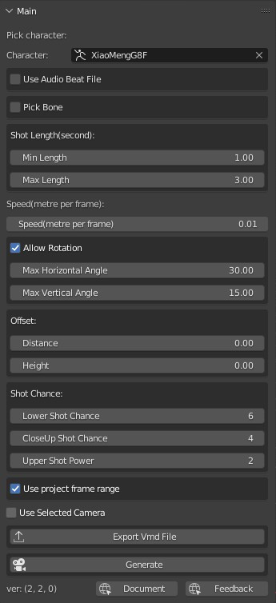

# Blender 扩展: Auto Dance Camera
一个舞蹈动画经常有5000-7000帧，如果手动创建镜头运动会非常麻烦。  

**该Blender扩展能够一键生成整个跳舞动画的镜头数据。它生成专业水准的镜头，并包含4x3x3x3x5=540种镜头组合方式。**  

**因此，你再也不用找镜头数据，或手动为跳舞动画制作镜头运动了。**  

    

# 演示视频
  
b站：  
[https://www.bilibili.com/video/BV1HR4y1A7TG/](https://www.bilibili.com/video/BV1HR4y1A7TG/)  

一整首歌的镜头演示视频:  
  
b站：  
[https://www.bilibili.com/video/BV15T4y167xg](https://www.bilibili.com/video/BV15T4y167xg)  

# 关键信息
### 下载

**Blender市场：**  
[https://blendermarket.com/products/auto-dance-camera](https://blendermarket.com/products/auto-dance-camera)  

**微博专栏：**  
[https://weibo.com/a/hot/7621648315881473_1.html](https://weibo.com/a/hot/7621648315881473_1.html)  

以上两种方式均可，一样的。

### Github
Github项目池只有文档，用于交流，不含有扩展代码  
[https://github.com/butaixianran/Blender-Auto-Dance-Camera](https://github.com/butaixianran/Blender-Auto-Dance-Camera)  

### 版本
本扩展: 2.0.1  
Blender: 3.0或以上

# 功能
* **全自动为舞蹈动画，生成摄像机运动**
* **（新）导出摄像机运动为vmd文件，从而可用于MMD中**
* 可重新生成指定片段的镜头运动
* 可调节镜头移动速度，最大最小镜头长度，因此既能用于跳舞动画，也能用于抒情慢歌 
* 允许只生成正面镜头(利于合成)
* 结合4x3x3x3x5=共540种镜头组合，但不合适的会过滤掉，只会生成和人物当前姿势匹配的动作
* 跟踪人眼，以防止人物跑出画面
* 自定义偏移，从而适配各种人模

# 安装
* 安装你得到的.zip文件
* 在扩展列表中，搜索 "Auto Dance Camera" 并启用
* 视图区域按N，右侧点开"Auto Dance Camera"面板即可

如果你是Blender新手，不知道如何安装扩展，请网络搜索"Blender 安装扩展"  

# 支持的人模
**任何类型。** 本扩展内建支持人模：**Daz, CC3, MMD, Rigify, Mixamo**  

如果你的人模不是其中一种，只需在扩展面板勾选"Pick Bone"，并选择对应骨骼后，即可使用。    

# 使用方法
## 生成摄影机运动
* 在扩展面板上，用吸管选择你的人模
* 点击下方 "生成" 按钮，完成

在你当前Collection下，会新建一个叫"Auto Dance Camera"的相机，带有运动数据，并自动设置为当前相机。  

## 导出Vmd文件
* **选择一个摄影机**（或它的空父亲对象，也可以）
* 点击"导出Vmd文件"，保存，完成

现在，你选择的摄影机上的运动，就保存在了这个vmd文件中，**可以用于mmd。不是本扩展生成摄影机，也可以导出！**  

# 技巧
* **移动相机的空父亲对象**，可整体调整镜头  
* **可多次点击生成按钮**，然后从生成的镜头中，选择你最喜欢的
* **对于抒情慢歌**，设置镜头长度为最小3秒，最大5秒，速度为0.004比较好
* 选择生成的摄影机，勾选"使用已选择的摄影机"，设置起始帧，**就能反复重新生成这一小段**，直到得到你喜欢的镜头

## Apply Transform 问题
如果你使用Mixamo，或任何其他在导入时没有替你"Apply Transform Rotation"的人模，那么你在使用人模前，需要应用transform。  

只需选择人模骨架，按`ctrl+A`，选择`Rotation`即可完成转换

# 支持的摄像机运动方式
扩展会尝试把人眼放在镜头的上1/3区域，就像专业摄影师那样。  

如果人模在单个镜头中快速移动，它会尝试跟随  

* 支持的镜头类型有：全景，中景，下半身中景，近景  
* 支持的旋转类型有：固定，上下左右4个方向旋转  
* 支持的移动方式有：固定，缩放，左右平移，上移  

扩展会分析人模的姿势，并排除不适合该姿势的镜头组合，然后从剩下的组合中随机选择。  

镜头长度也是随机生成。  

# 非跳舞动画
把镜头持续时间设置得更长，就能用于其他场合。  

# 选项
## 选择骨骼
如果你的人模不是 "`Daz, CC3, MMD, Rigify, Mixamo`" 中的一种，你就需要勾选这个选项，并选择对应骨骼名字，本扩展才能用    

  

## 镜头长度
最大最小镜头长度，单位是秒。扩展会根据你项目的fps设置，换算成帧数  

默认值用于跳舞歌曲，用于抒情慢歌的话，最小长度为3秒，最大为5秒，会比较好  

## 镜头移动速度
默认是每帧0.008米，这是跳舞歌曲的设置。抒情慢歌的话，设为0.004比较好  

## 允许旋转
去掉后，就只会生成正面镜头。有利于做合成视频。  

## 偏移
可以指定偏移，或，直接调整生成的摄影机的空父亲对象  

# 镜头出现概率
下半身镜头对准腿部，既可能显得性感，也可能是很差的镜头选择。因此，有时候你会希望减少下半身镜头数量   

它的出现概率，是0.25/本选项的数值。也就是说，本选项的数值越大，出现的该镜头就越少。    

近景镜头概率选项也是同理  

## 使用项目帧范围
去掉勾选后，可以指定要生成的帧范围  

## 使用当前选择的摄影机
这个选项非常强大，勾选后，它能够将生成的运动，添加到你当前选择的摄像机。  

如果这个摄像机上，已经有镜头运动了，比如，一个本扩展生成的摄像机。那么，扩展会只清除你指定范围内的帧数据，并把新的运动，只添加到这个范围内。  

这意味着，如果生成的完整数据中，有某个镜头你不喜欢，你可以选择这一小段，反复点击本扩展的生成按钮，直到生成一个能接受的镜头  

# 常见问题
## 人物跑出画面
本扩展并不是在每一帧都跟踪眼球。而是只在每个镜头的第一帧 和 最后一帧检查眼球位置。  

所以，如果人物在单个镜头内，快速移动离开镜头，又快速回来。那么本扩展将无法察觉。  

每帧都追踪眼球将导致生成巨慢无比，不可接受。比较高效的办法，是对于这种情况，直接重新生成一个全身镜头即可。  

# 更新日志
## 2.0.1
* 修复当人物一直保持坐姿时，才会出现的多个随机方法bug。

## 2.0.0
* 支持导出摄影机运动为 vmd 文件，从而用于mmd中

## 1.0.0
* 添加i18n
* 添加"Pick bone"选项
* 第一个发布版本

