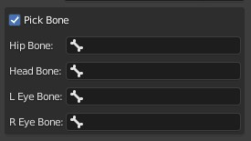
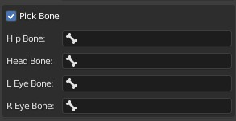

# Language
[中文](README.cn.md)  

# Blender addon: Auto Dance Camera
A dance animation normally comes with 5000-7000 frames. Creating its camera motion is painful.  

**This blender addon can create camera motion for your dance animation automatically, with professional composition and combine with 4x3x3x3x5=540 total different shots.**  

**So, you don't need do that manually anymore.**  

# Demo Video
  

A full song demo video:  
  

# Info
### Download

### Github
Github repo is for document and issues. There is no code in it.  
[https://github.com/butaixianran/Blender-Addon-Auto-Dance-Camera](https://github.com/butaixianran/Blender-Addon-Auto-Dance-Camera)  

### Version
Addon: 1.0.0  
Blender: 3.0 or later

# Feature
* Generate character's camera motion automatically
* Re-generate a range of the motion
* Adjust moving speed, min and max length of shots, so it can be use to both pop song and slow romantic song. 
* Can only generate front shot if needed (good for composing)
* Combine 4x3x3x3x5=540 total shots and only generate those can fit for character's pose
* Track eye position to prevent character moves out frame.
* Set offset to fit with any kind of characters

# Install
* Install the .zip file you get from online shop.
* Search "Auto Dance Camera" in your addon list and enable it
* In viewport, press "N" to display tool panels, select "Auto Dance Camera" panel

If you are new to blender and don't know how to install a blender addon, search: "blender install addon" in google.  

# Supported Character
Any type. It has build-in support for: **Daz, CC3, MMD, Rigify, Mixamo**  

If your character is not one of them, just check "Pick Bone" on addon panel, then select bone names it needed.   
  

# How to use
* Pick your character's Armature on addon's panel
* Click "Generate" button, done.

It will create a new camera named "Auto Dance Camera" with motion on it in your active collection, and set that camera as active camera.  

# Tips
* Move camera's empty parent object can adjust the whole camera motion.  

* Click "Generate" button mutiple times, then pick the one you like most.  

* For slow romantic song, set shot length min to 3, max to 5 and speed to 0.004 will be better  

* Select a generated camera, check "Use selected camera", and set a frame range. Then you can re-generate that range again and again, until you get a shot you like.  

## Apply Transform Issue
If you are using **Mixamo** or any model that has not "Apply Transfrom Rotation" when importing, you need to do this before using it.  

Just select the armature, press `ctrl+A`, click `Rotation` to apply.  

# Supported camera motion
This addon will try to put character's eye on the top 1/3 area of the camera frame. Like a professional cameraman.   

If character moves too far away in a single shot, it will try to follow.  

* Supported shot types: full shot, medium shot, lower shot, close-up shot  
* Supported rotation types: fix, left, right, up, down  
* Supported camera movements: fix, zoom in, zoom out, left pan, right pan, move up  

It will check your character's pose and remove those shots won't fit for this pose, then pick one shot randomly.   

Shot length is also generated randomly.   

# For non-Dance motion
Change the setting, make shot length longer, then it can be used in other cases.  

# Options
## Pick Bone
If your character is not one of "`Daz, CC3, MMD, Rigify, Mixamo`", you need to check this and select bone names it needed.  

  

## Shot length
Min and max shot length, in second.  

Addon will convert it to frame numbers based on your project's fps setting.  

Default value is for pop song. For slow romantic song, change min length to 3, max length to 5 will be better.  

## Camera move speed
Default is 0.008 metre per frame, which is for pop song. For slow romantic song, change it to 0.004 will be better  

## Allow Rotation
Uncheck to only generate front shot.  

This can be good for composing.  

## Offset
Add your own offset, or, just move the empty parent of generated camera.  

# Shot Chance
Lower shot is targeting on legs, which can be very sexy or a very bad choice. So in some cases you may wish to have less lower shots.  

The chance of low shot is 0.25/this value. So, the bigger of this value, the less lower shots you will have.  

The same as Close-Up Shot Chance.    

## Use Project's frame setting
Uncheck to input your own frame range  

## Use selected camera
**This option is very powerful**, check it, it will add motion to the camera you currently selected.   

If this camera already has motion on it, for example, a camera generated by this addon, it will only remove the camera motion on the frame range you set. Then add new motion only to this range.  

**That means, if you don't like a shot in the generated motion, you can select that frame range, click the button to generate motion only for that part again and again, until you get a motion you like.**  

# Common Issues
## Character moves out frame
This addon does not track character's eyes on every frame. It only do that at every shot's first and last frame.  

So, if character moves out frame and moves back very quickly in a single shot, this addon won't know about it.  

If it tracks eyes on every frame, it will be extremely slow. Better just re-generate the single shot you don't like.  

# Update Log
## 1.0.0
* add i18n
* add "Pick bone" option
* first release

